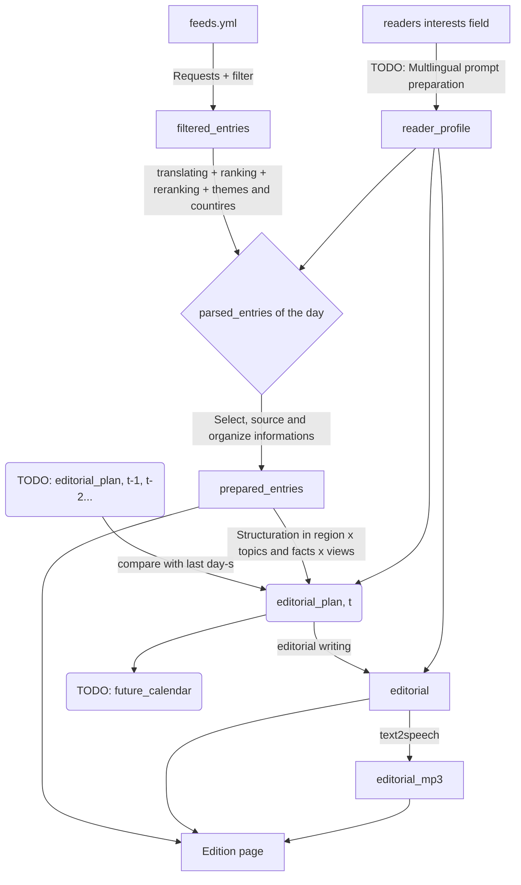

# Pressroom


A small, automated pipeline that turns a curated list of RSS feeds into a daily static newspaper page with a synthesized editorial, served as a multi-user Flask webapp backed by SQLite.


## To-be-added features

|  Feature  | Category  |
|  ---  | ---  |
|  Refactored user preference specification setup, which automatically handles translation + better translation behavior, possibly test different translation models/approaches (`llama3.1:8b-instruct` v.s. `deepseeek-v4-flash` v.s. `qwen2.5:7b-instruct` v.s. `argostranslate 1.11.0`).  |  **Streamline** the base `edition` experience |
| Ability to send the press briefings (especially the editorials, in audio format) via a telegram bot + a summary of the day's articles, as a telegram message which you get in the morning.  |  **Streamline** the base `edition` experience |
| Persistence in the writing of briefings, using multiple, lagged news_summary objects.  |  **Improve** the base `edition` experience |
| Add calendar persistent variable, which feeds into a calendar widget. The idea being that this displays upcoming (political) events. |  **Improve** the base `edition` experience |
| Add a map widget, showing geographical coverage (puts the articles on a map). |  **Improve** the base `edition` experience |
| Create a mode selector page, and the possibility to enable/disable schedueles.  | **Enable** new modes|
| Add an alert/dedicated briefing system, where the user can setup alerts on specific topics/geographies/organization/people. And get a special section generated accordingly. This section should also be possible to share on an open page to be sent to people, or via a telegram bot.  | **Create** `alert` mode|
| Add ISSN or DOI feeds for research papers.  |  **Create** a research version of the alert mode `lab` |


## Webapp

The system is a Flask webapp hooked onto SQLite (`data/pressroom.db`).

- **Login** — connecting to the site redirects to `/login`. Credentials: demo user `titou` / `titou` and `demo_user` / `demo_user` (seeded from the `data/` folder). The login page shows a random photo (with caption) from any user's stored issue on the right, and a sign-up button on the left. New accounts are created at `/signup` and are seeded with the demo `feeds.yml` and `readers_interests.md`.
- **Admin** — a user with the `is_admin` flag sees an **Admin** link in the top bar and reaches `/admin`: list all users (with pipeline-run counts), create and delete accounts, and inspect every stored pipeline item in `/admin/data`. The inspector lets you pick a user + day, shows the pipeline run date and a full-width clickable flow diagram (feeds.yml / readers_interests.md inputs + the four stage outputs), and displays the selected stage's content (YAML as text, MP3 as audio with a download link). Access is restricted; non-admin users get a 403. Admin rights are granted by a Python call (see "Running" below).
- **Per-user data** — each user stores their own `feeds.yml` and `readers_interests.md` in the `user_files` table, plus an `editorial_minutes` setting (target editorial read time, 2-10 minutes), an `excluded_domains` list (domains left out of the archive.ph link wrapper), and a `filter_mode` setting (`"24h"` or `"today"`) controlling how recent articles are kept.
- **Article date filtering** — during scraping, a publication in `feeds.yml` can carry `today_only: true` to keep only that day's articles instead of the rolling `max_age` window (24h). This overrides the user's global `filter_mode`. The global setting is exposed in the settings page ("Dernières 24 heures" vs "Aujourd'hui uniquement").
- **Per-user per-day issues** — each pipeline stage's output (`filtered_entries`, `parsed_entries`, `prepared_entries`, `editorial.mp3`) is stored in `issue_artifacts`, keyed by `(user, day)` in `issues`. History of editorials, one per day.
- **Date shown in the top bar** — is the time the pipeline ran for that issue (`issues.run_at`), not the page-rendering time. That time is displayed in the configured `schedule.timezone` (default `Europe/Paris`).
- **Report picker** — clicking the date in the top bar opens a dropdown listing the last 7 days' issues (at most); clicking an entry regenerates the page from that report. The currently displayed day is highlighted.
- **Settings** — the top bar links to `/settings`, where the user can edit their RSS feeds (`feeds.yml`) through a form (add/remove publications and feed URLs, set language, optionally tick "Aujourd'hui uniquement" per publication), download or import the full `feeds.yml` file, edit `readers_interests.md` as free text, set the target editorial length (2-10 minutes slider), choose the article date filter ("Dernières 24 heures" vs "Aujourd'hui uniquement"), set the list of domains excluded from the archive.ph link wrapper, change their username/password, and see the history of past pipeline runs. On narrow screens the top bar collapses into a hamburger menu. The feeds editor is collapsed by default and sits at the bottom of the page.
- **Archive.ph links** — article links are wrapped through `archive.ph` unless their domain is in the user's `excluded_domains` list (one per line in settings). Users who have never set the list fall back to the built-in `DEFAULT_EXCLUDED_DOMAINS` in `src/config.py`.
- **Daily schedule** — the webapp runs the pipeline once per day at a configured local time (default 06:00) for every user currently in the database (accounts created through the admin panel are picked up automatically, no restart needed); users lacking `feeds.yml`/`readers_interests.md` are skipped. The schedule is configured in `config.yml` (`schedule.time`, `schedule.enabled`). The scheduling thread starts with the app (a daemon thread in `src/scheduler.py`).
- **Page generation on login** — after login, the latest (or a historical) issue is rendered from the database.

### Running

```bash
conda activate press_room
cd /path/to/press_room

# 1. Seed the database with the demo users 'titou' and 'demo_user' (copies data/ files in)
python -c "import src.db as d; d.init_db(); d.seed_demo_user()"

# Grant admin rights to a user (e.g. demo_user)
python -c "import src.db as d; d.set_admin('demo_user')"

# 2. Run the pipeline for a user (writes all artifacts to SQLite)
python -m src.run_pipeline --user titou

# 3. Start the webapp (login at http://localhost:5000)
python app.py
```

## Database

The database is a single SQLite file `data/pressroom.db`, created on first run and ignored by git.

### Schema

```sql
-- One row per user account. Passwords are stored as werkzeug password hashes.
-- is_admin = admin rights (1) or not (0); grants access to /admin.
-- editorial_minutes = target editorial read time (2-10 min); the LLM word range
-- is derived as 200 * minutes ± 150 words.
-- excluded_domains = user's archive.ph-excluded domains, one per line
-- (NULL/absent means "use the default list in src/config.py").
-- filter_mode = article date filter: "today" or NULL (= "24h").
CREATE TABLE users (
    id                INTEGER PRIMARY KEY AUTOINCREMENT,
    username          TEXT NOT NULL UNIQUE,
    password_hash     TEXT NOT NULL,
    is_admin          INTEGER NOT NULL DEFAULT 0,
    editorial_minutes INTEGER NOT NULL DEFAULT 5,
    excluded_domains  TEXT,
    filter_mode       TEXT,
    created_at        TEXT NOT NULL DEFAULT (datetime('now'))
);

-- Per-user configuration files: 'feeds.yml' and 'readers_interests.md'.
CREATE TABLE user_files (
    id         INTEGER PRIMARY KEY AUTOINCREMENT,
    user_id    INTEGER NOT NULL REFERENCES users(id) ON DELETE CASCADE,
    name       TEXT NOT NULL,          -- e.g. 'feeds.yml', 'readers_interests.md'
    content    TEXT NOT NULL,          -- raw file contents
    updated_at TEXT NOT NULL DEFAULT (datetime('now')),
    UNIQUE(user_id, name)
);

-- One issue per (user, day). run_at = when the pipeline last ran for it.
CREATE TABLE issues (
    id               INTEGER PRIMARY KEY AUTOINCREMENT,
    user_id          INTEGER NOT NULL REFERENCES users(id) ON DELETE CASCADE,
    day              TEXT NOT NULL,          -- ISO date, e.g. '2026-08-06'
    pipeline_version INTEGER NOT NULL DEFAULT 0,
    run_at           TEXT NOT NULL DEFAULT (datetime('now','localtime')),
    created_at       TEXT NOT NULL DEFAULT (datetime('now')),
    UNIQUE(user_id, day)
);

-- Pipeline outputs for a given issue (feeds/parsed/editorial/audio, …).
CREATE TABLE issue_artifacts (
    id         INTEGER PRIMARY KEY AUTOINCREMENT,
    issue_id   INTEGER NOT NULL REFERENCES issues(id) ON DELETE CASCADE,
    stage      TEXT NOT NULL,          -- 'feeds.yml' | 'readers_interests.md' | 'filtered_entries' | 'parsed_entries' | 'editorial' | 'editorial_mp3'
    content    BLOB NOT NULL,          -- YAML (text) or MP3 (binary)
    created_at TEXT NOT NULL DEFAULT (datetime('now')),
    UNIQUE(issue_id, stage)
);

-- Prepared articles, one row per EID (pipeline_version 1).
-- The full original entry is kept verbatim in `data`; the main fields are
-- denormalised into columns so they can be queried/filtered by EID or issue_id.
CREATE TABLE prepared_entries (
    id               INTEGER PRIMARY KEY AUTOINCREMENT,
    issue_id         INTEGER NOT NULL REFERENCES issues(id) ON DELETE CASCADE,
    eid              TEXT NOT NULL,
    data             TEXT NOT NULL,
    title            TEXT,
    summary          TEXT,
    media            TEXT,
    url              TEXT,
    date             TEXT,
    lang             TEXT,
    author           TEXT,
    source           TEXT,
    similarity_score REAL,
    rerank_reason    TEXT,
    theme            TEXT,
    country          TEXT,
    section          TEXT,
    position         INTEGER NOT NULL DEFAULT 0,
    created_at       TEXT NOT NULL DEFAULT (datetime('now')),
    UNIQUE(issue_id, eid)
);
```

**Pipeline versions.** `issues.pipeline_version` records the storage layout of an
issue. `0` = legacy (v0): the editorial text + headline are embedded inside the
`prepared_entries` blob, and only the blob is stored. `1` = current (v1): the
editorial is stored in its own `editorial` artifact row (`{title: ...,
editorial: ...}`), the prepared articles are stored relationally in the
`prepared_entries` table (one row per EID, keyed by `issue_id`), and no
`prepared_entries` blob is written. `init_db()` runs
`backfill_issue_editorials()` and `discard_legacy_prepared_eids()` so old issues
remain readable: v0 issues fall back to their blob on render, and any leftover
integer-keyed table rows (a v0 artifact) are dropped.

### Usage

All functions live in `src/db.py` and accept an optional `db_path` argument (defaults to `DEFAULT_DB_PATH` from `src/config.py`).

| Function | Purpose |
|---|---|
| `init_db()` | Create tables (and migrate older DBs that lack `issues.run_at`). |
| `create_user(username, password)` | Create a user; returns its id. |
| `get_user(username)` / `verify_user(username, password)` | Look up / authenticate a user. |
| `update_username(user_id, username)` / `update_password(user_id, password)` | Change a user's name (raises if taken) / password. |
| `get_editorial_minutes(user_id)` / `set_editorial_minutes(user_id, minutes)` | Read / write the target editorial read time (clamped 2-10). |
| `get_excluded_domains(user_id)` / `set_excluded_domains(user_id, domains)` | Read / write the user's archive.ph-excluded domains (falls back to `DEFAULT_EXCLUDED_DOMAINS` when never set; an empty list excludes nothing). |
| `list_users()` | All users. |
| `user_is_admin(user)` / `is_admin_user(username)` / `set_admin(username, is_admin=True)` | Read the admin flag from a users row / by username, or grant/revoke admin rights (returns whether a row was updated). |
| `delete_user(username)` | Remove a user (and cascade its files/issues/artifacts). |
| `list_users_with_counts()` | All users with a `run_count` of issues (pipeline runs). |
| `seed_default_files(user_id)` | Copy `data/feeds.yml` + `data/readers_interests.md` into a user's config files. |
| `set_user_file(user_id, name, content)` / `get_user_file(user_id, name)` / `list_user_files(user_id)` | Read/write the user's config files. |
| `get_or_create_issue(user_id, day)` | Return the issue id for a user/day, creating it and stamping `run_at` if needed. |
| `set_artifact(issue_id, stage, content)` / `get_artifact(issue_id, stage)` | Store / fetch a pipeline stage output (bytes). |
| `set_pipeline_version(issue_id, version)` | Stamp the storage layout version of an issue (v0 = editorial inside the `prepared_entries` blob; v1 = separate `editorial` row + relational `prepared_entries` table). |
| `set_prepared_entries(issue_id, entries)` / `get_prepared_entries(issue_id)` | Replace / fetch all prepared entries of an issue (one row per EID, ordered by section position). |
| `get_prepared_entry(issue_id, eid)` / `count_prepared_entries(issue_id)` | Fetch a single prepared entry by EID / count the rows of an issue. |
| `backfill_issue_editorials()` | Upgrade issues to v1: extract the editorial into its own row and stamp `pipeline_version=1` (idempotent). |
| `discard_legacy_prepared_eids()` | Drop `prepared_entries` rows keyed by legacy integer EIDs (v0 leftovers); returns the number removed. |
| `list_issues(user_id)` / `latest_issue(user_id)` | All issues for a user (newest first) / the latest one. |
| `get_issue(user_id, day)` / `list_artifacts(issue_id)` | Get a specific issue / the artifact stages (with sizes) of an issue. |
| `seed_demo_user()` | Create `titou`/`titou` and `demo_user`/`demo_user`, copy `data/` files into their `user_files`, and seed today's issue with the demo artifacts. |

All functions accept an optional `db_path` argument (defaults to `data/pressroom.db`).


## What it does


1. **Scrape** – fetches the RSS feeds listed in the user's `feeds.yml`, filters articles by publication date (24h window, or that day only when the user's `filter_mode` is `"today"` or a publication sets `today_only: true`), and writes `filtered_entries`.
2. **Parse** – ranks articles by semantic similarity to the user's `readers_interests.md`, diversifies sources, reranks the top candidates with an LLM for diversity and importance, assigns theme and country tags to each selected article ("international" if multiple countries are concerned), translates non-French text to French, and writes `parsed_entries`.
3. **Prepare** – writes the French editorial and headline (stored as its own `editorial` artifact in pipeline_version ≥1), classifies the parsed articles into thematic sections of ~`section_size` articles each (1–2 word titles), and stores the articles relationally in the `prepared_entries` table (one row per EID, in section order) instead of a blob. The editorial's target length is derived from the user's `editorial_minutes` (word range = 200 × minutes ± 150), injected into the `edito.md` prompt via the `{ word_min }` / `{ word_max }` placeholders.
4. **Speak** – synthesizes the editorial to `editorial.mp3` via OpenRouter's TTS API.

All four artifacts are stored per user/day in SQLite. The newspaper HTML is generated on login from the stored data.


## Repository layout

```
.
├── app.py                    # Flask webapp (login, per-user page rendering, /settings, daily scheduler)
├── config.yml                # Optional overrides (paths, models, pipeline, web, schedule, …; gitignored)
├── requirements.txt          # Runtime + test deps with tolerant version floors
├── data/                     # Source config + demo pipeline outputs (seeded for 'titou')
│   ├── additional_rerank_prompt.md
│   ├── edito.md              # Prompt for the editorial
│   ├── editorial.mp3         # Demo audio (also copied to DB on seed)
│   ├── feeds.yml             # Demo RSS sources (seeded for user 'titou')
│   ├── filtered_entries.yml  # Demo output (seeded)
│   ├── parsed_entries.yml    # Demo output (seeded)
│   ├── prepared_entries.yml  # Demo output (seeded)
│   ├── pressroom.db          # SQLite database (created on first run, gitignored)
│   ├── titre.md
│   └── readers_interests.md  # Demo reader profile (seeded)
└── src/
    ├── __init__.py
    ├── config.py              # Defaults for paths, models, serve port, pipeline limits, config.yml loader
    ├── db.py                 # SQLite schema + seed + CRUD for users/files/issues/artifacts
    ├── editorial_to_mp3.py   # Step 4: editorial audio synthesis
    ├── feed_reader.py        # Step 1: RSS scraping
    ├── gen_static_page.py    # HTML generation (used at login time)
    ├── key.py                # OpenRouter API key (gitignored)
    ├── parse_feed.py         # Step 2: ranking, reranking, translation
    ├── prepare_entries.py    # Step 3: editorial + section classification
    ├── rank_entries.py       # WordLlama semantic ranking helper
    ├── rerank_llm.py         # LLM reranking helper
    ├── run_pipeline.py       # Per-user pipeline trigger (writes to SQLite)
    ├── scheduler.py          # Daily scheduler thread (runs the pipeline for every DB user, re-read each run)
    ├── serve.py              # Legacy static file server
    └── templates/
        ├── article.html
        ├── login.html
        ├── page.css
        ├── page.html
        ├── page.js
        ├── reader.html
        ├── settings.html       # User settings panel (feeds, preferences, credentials, run history)
        └── signup.html         # Account creation page
```

## Requirements

- Python 3.12
- Conda (the project uses a Conda environment, not venv)
- An OpenRouter API key (stored in `src/key.py`)
- The packages in `requirements.txt` (runtime + pytest)

## Setup

1. Create and activate the Conda environment:

```bash
conda create -n press_room python=3.12 -y
conda activate press_room
pip install -r requirements.txt
```

2. Add your OpenRouter API key to `src/key.py`.

3. Seed the database and run (see "Running" above).

## Running the pipeline

To compute today's issue for a user (writes all artifacts to SQLite):

```bash
conda activate press_room
cd /path/to/press_room
python -m src.run_pipeline --user titou
# optionally pin a day: python -m src.run_pipeline --user titou --day 2026-08-06
```

`run_pipeline.run_for_user()` calls each step in sequence, staging the user's
files (`feeds.yml`, `readers_interests.md`) in a temp dir and storing every
stage's output in the `issue_artifacts` table:

- `feed_reader.scrape_feeds()`
- `parse_feed.parse_and_export()`
- `prepare_entries.prepare_and_export()`
- `editorial_to_mp3.generate_editorial_mp3()`

You can also run each step individually against the `data/` folder (legacy):

```bash
python -m src.feed_reader
python -m src.parse_feed
python -m src.prepare_entries
python -m src.editorial_to_mp3
```

## Serving the webapp

Start the Flask app (login page at the root):

```bash
conda activate press_room
cd /path/to/press_room
python app.py
```

- Visit `http://localhost:5000/` — you will be redirected to `/login`.
- Log in as `titou` / `titou` to see the latest issue.
- Add `?day=YYYY-MM-DD` to view a historical issue stored in the database.

The app starts a background thread (see `config.yml` → `schedule`) that runs the
pipeline daily at the configured local time (default 06:00) for every user in the
database, re-reading the user list at each run.

## Customization

All configuration lives in `config.yml` at the project root. Every value
defaults to the built-in ones in `src/config.py`, so the project works even without
a `config.yml`. Values in `config.yml` override the defaults:

- **Paths:** the `paths:` block (`data_dir`, and the file names for feeds, the pipeline stages' YAML files, the MP3, `interests`, `title_guide`, `additional_rerank_prompt`, `template_dir`, and `db`).
- **Editorial:** `editorial.minutes` — default target editorial read time (2-10 min), used when a user has not set their own.
- **Models:** the `models:` block — `default` (reranking/translation/title extraction), `fancy` (editorial), and `section` (section classification). The default slugs include `:nitro` for faster inference on OpenRouter.
- **Pipeline:** the `pipeline:` block — `candidates_count`, `final_count` (number of articles), `section_size`, and `max_per_source` (cap candidates per newspaper before LLM reranking).
- **Web:** the `web:` block — `secret_key` and `port`. The secret key resolves with this precedence: `PRESSROOM_SECRET_KEY` env var → `config.yml` → a fresh key generated and persisted into the gitignored `config.yml` on first boot (the placeholder `dev-secret-change-me` does not count as a real key).
- **Archive.ph exclusions:** `excluded_domains` (list of domains left out of the archive.ph link wrapper; this is the default list new/never-configured users fall back to).
- **Schedule:** the `schedule:` block — `enabled` and `time` (`"HH:MM"`, local time in `timezone`; `timezone` is an IANA zone, e.g. `Europe/Paris`, falling back to `Europe/Paris` if invalid). The daily run covers all users in the database; `users` is ignored by the scheduler (kept only for compatibility).
- **TTS voice:** edit `DEFAULT_VOICE` in `src/editorial_to_mp3.py`.
- **Styling:** edit `src/templates/page.html`, `src/templates/article.html`, and `src/templates/page.css`.

## Notes

- The extracted headline and the pipeline run time (in French) are displayed at the top of the generated page in a large, responsive font. Run timestamps are stored as UTC ISO-8601 (with offset) and rendered in `schedule.timezone`.
- The database `data/pressroom.db` is created on first run and ignored by git.
